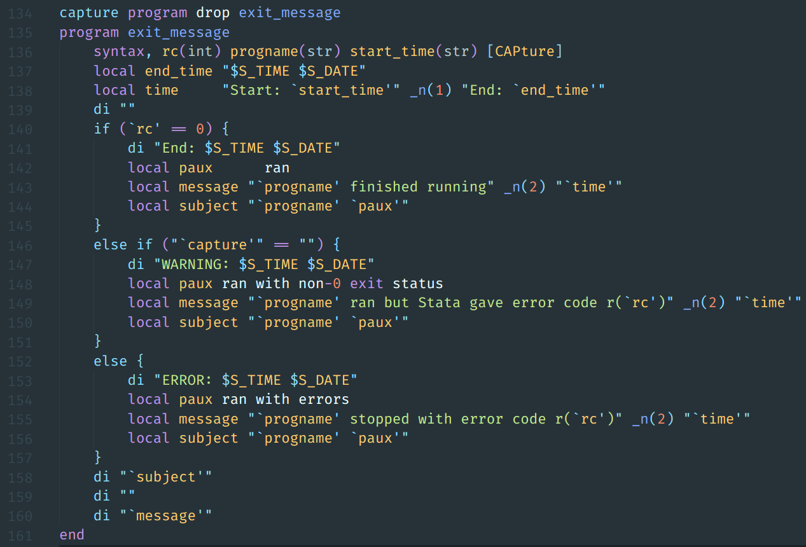

# Stata language support in Visual Studio Code
[](https://github.com/kylebarron/language-stata)
[](https://github.com/kylebarron/language-stata)

#### Stata syntax highlighting in Visual Studio Code, built from the ground up.
Also [available for Atom](https://github.com/kylebarron/language-stata).


Code snippet from [Gtools](https://github.com/mcaceresb/stata-gtools), a faster implementation of Stata's collapse and egen using C plugins. Shown with the [Material](https://marketplace.visualstudio.com/items?itemName=Equinusocio.vsc-material-theme) theme.


## Features

This package highlights:
- System commands, functions, and function arguments
- Macros, both global and local
    - Accurately colors nested macros and escaped macros in strings when you want the inner macro to evaluate at runtime
    - Colors macro extended functions inside `` `: ... '`` as well as after `local lname:`
- Comments, [more accurately than Stata's Do-file Editor](examples/comments.md).
- Regular expressions
    - Colors both the limited syntax provided through the `regexr()` and `regexm()` functions, as well as the vastly expanded regex syntax provided in Stata 14 and 15 through the `ustrregexm()`, `ustrregexrf()`, and `ustrregexra()` functions.
- Dynamic Markdown and LaTeX documents. [Instructions below.](#dynamic-documents)

Other nice features:
- Works with unicode identifiers. Use unicode anywhere it's legal Stata syntax.
- Alerts you if your variable name is illegal, i.e. if your variable name is more than 32 chars, starts with a number, or is a reserved name.
- Alerts you if you have any text other than } on a line ending a foreach/forvalues/if/else command
- Local macro back tick autocompletion. When you write a `, Visual Studio Code automatically fills in a ' after your cursor
- Makes it easy to spot incorrect nesting of compound quotes
- Support for programming ligatures for all valid Stata syntax for fonts that support them, like the [Fira Code](https://github.com/tonsky/FiraCode) font.
- Highlights SQL queries used in the odbc command. (The language-sql base package must be active.)

#### Note
Some themes may not color all parts of the syntax.

## Installation
Launch VS Code Quick Open (Ctrl+P), paste the following command, and press enter.
```
ext install stata-enhanced
```

## Running Code

This package doesn't have the capabilities to run your code in Stata. If you're using Linux, you can use my [scripts](https://github.com/kylebarron/stata-autokey) with the [Autokey](https://github.com/autokey-py3/autokey) automation utility to quickly run selections of your files in a graphical session of Stata.

You might also be interested in trying to port Atom's `stata-exec` package.

## Dynamic Documents


Stata 15 brought new features for working with dynamic documents. The [`dyndoc`](https://www.stata.com/help.cgi?dyndoc) command lets you write in Markdown and converts your file and code to HTML for viewing in a web browser.

It also added the [`dyntext`](https://www.stata.com/help.cgi?dyntext) command, which fills in Stata output for any text file, without touching the text itself. This lets you then use third-party document generators like [Pandoc](https://pandoc.org/) and [LaTeX](https://www.latex-project.org/) to generate documents.

This package now provides syntax highlighting for Stata code written inside Stata's [dynamic tags](https://www.stata.com/help.cgi?dynamic+tags) for Markdown and LaTeX documents.

By default, this package's Markdown and LaTeX syntax highlighting will be applied for files ending in `.domd` and `.dotex` respectively. **The [Markdown All in One](https://marketplace.visualstudio.com/items?itemName=yzhang.markdown-all-in-one) and [LaTeX Workshop](https://marketplace.visualstudio.com/items?itemName=James-Yu.latex-workshop) packages must be installed for the highlighting to work.**

If you name your file with a different extension, you can manually set the highlighting by clicking on the "Plain Text" button on the bottom right of the screen (or by pressing <kbd>CTRL</kbd>+<kbd>SHIFT</kbd>+<kbd>L</kbd>) and then selecting `Stata Dyndoc (Markdown)` or `Stata Dyndoc (LaTeX)` from the drop-down menu.

### Examples

An example of the PDF output of using `dyntext` and Pandoc is in the examples folder: [`dyntext.pdf`](examples/dyntext.pdf).

That file was created by running

```stata
dyntext dyntext.domd, saving(dyntext.md) replace
```
from inside Stata 15, and then with

```
pandoc dyntext.md -o dyntext.pdf
```

on the command line using [Pandoc](https://pandoc.org/).

The file [`dyntext.dotex`](examples/dyntext.dotex) is a proof-of-concept and should compile with LaTeX but the output is not shown here.
