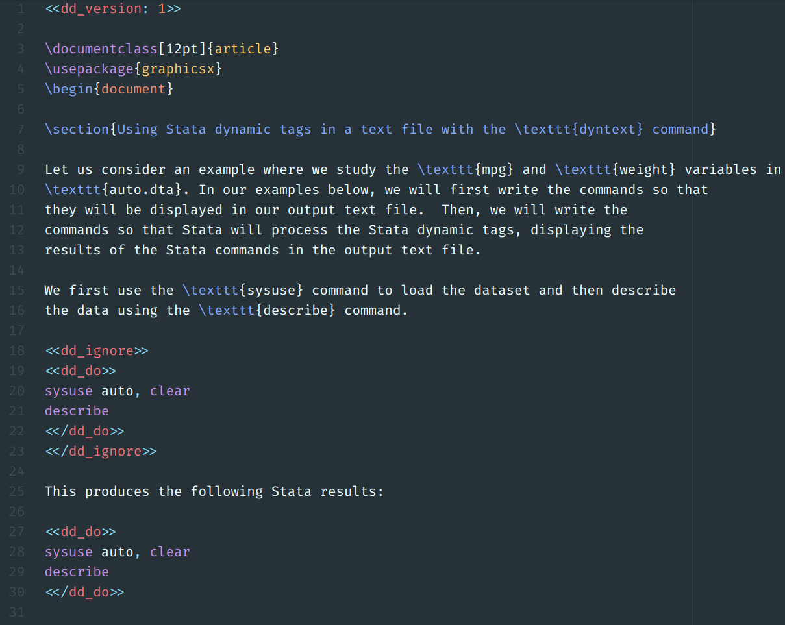

# Examples

## Comments

See [comments.md](comments.md) for information on how Stata deals with comments.

## Dynamic Documents

The file [`dyntext.pdf`](dyntext.pdf) in this folder was created with

```stata
dyntext dyntext.domd, saving(dyntext.md) replace
```

from inside Stata 15, and then with

```
pandoc dyntext.md -o dyntext.pdf
```

on the command line using [Pandoc](https://pandoc.org/).

The file [`dyntext.dotex`](dyntext.dotex) is a proof-of-concept and should compile with LaTeX but the output is not shown here.

---

#### `dyntext.domd`:


#### `dyntext.dotex`:



