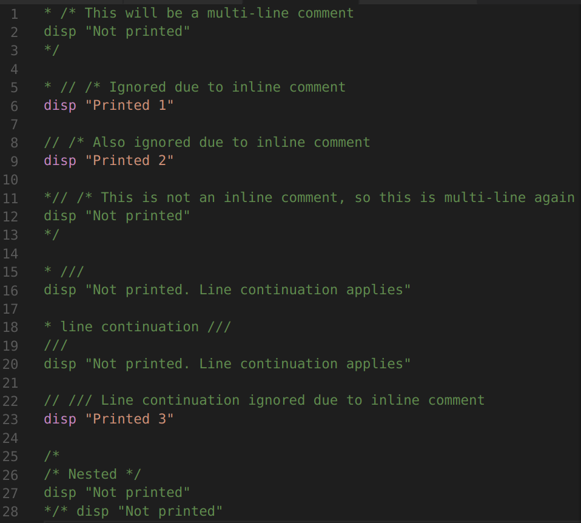
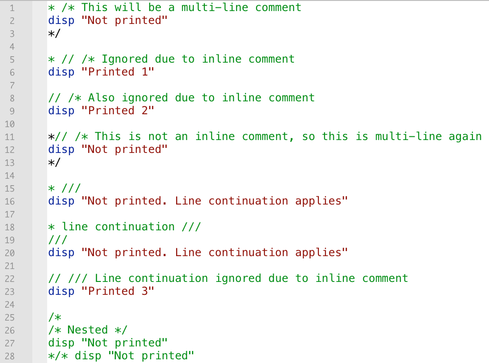
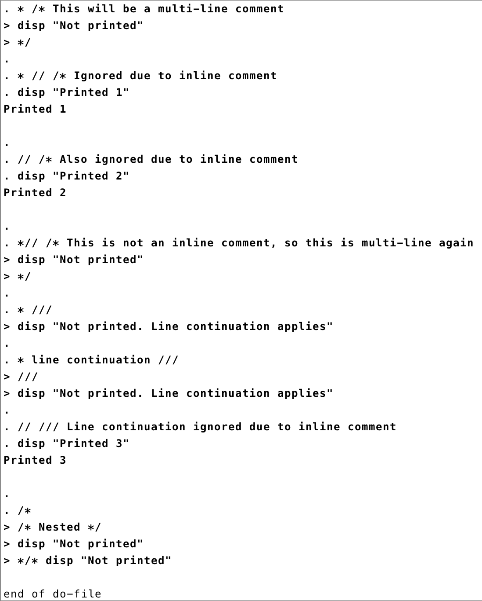

# Accurate comment highlighting

The intricates of Stata's comment syntax highlighting were brought to my attention by [this Statalist post](https://www.statalist.org/forums/forum/general-stata-discussion/general/1448244-understanding-stata-s-comment-hierarchy).

This package now highlights comments more accurately than the Stata Do-file Editor. This way you'll know exactly which parts of your do-file will actually run.

VS Code highlighter:


Dofile Editor:


Stata output (with Stata SE 15.1)


Here's the example text.

```stata
* /* This will be a multi-line comment
disp "Not printed"
*/

* // /* Ignored due to inline comment
disp "Printed 1"

// /* Also ignored due to inline comment
disp "Printed 2"

*// /* This is not an inline comment, so this is multi-line again
disp "Not printed"
*/

* ///
disp "Not printed. Line continuation applies"

* line continuation ///
///
disp "Not printed. Line continuation applies"

// /// Line continuation ignored due to inline comment
disp "Printed 3"

/*
/* Nested */
disp "Not printed"
*/* disp "Not printed"
```